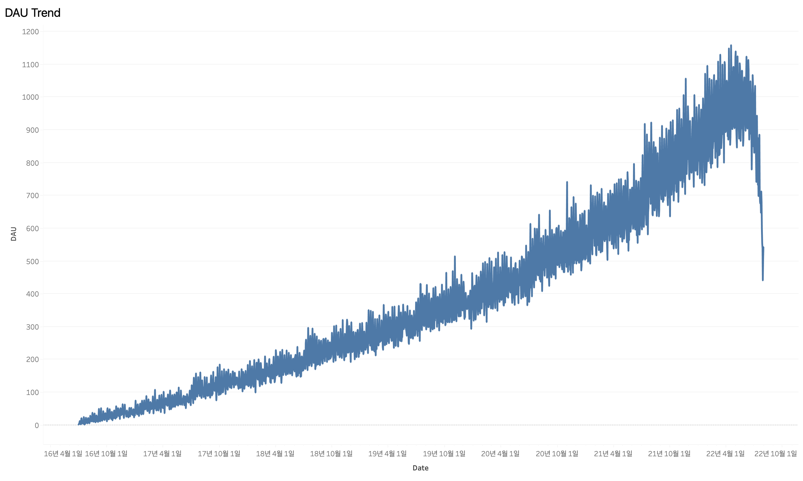
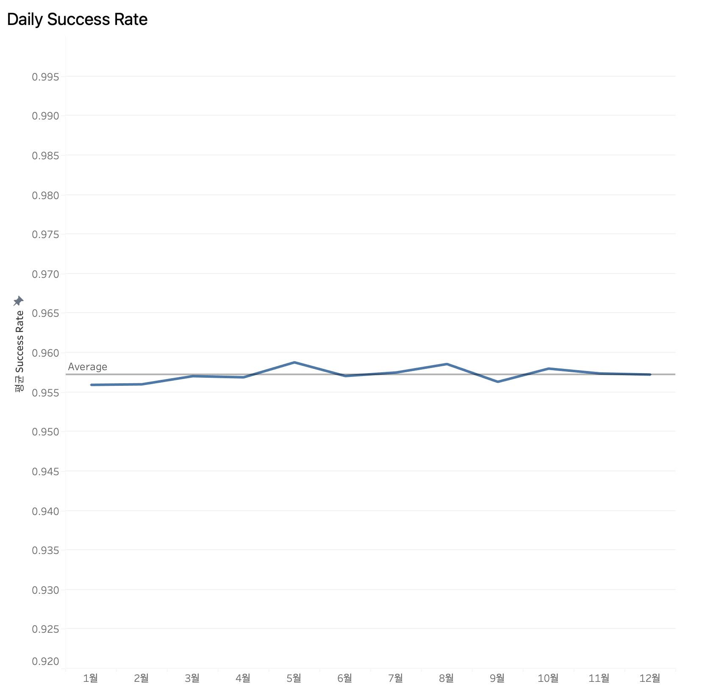
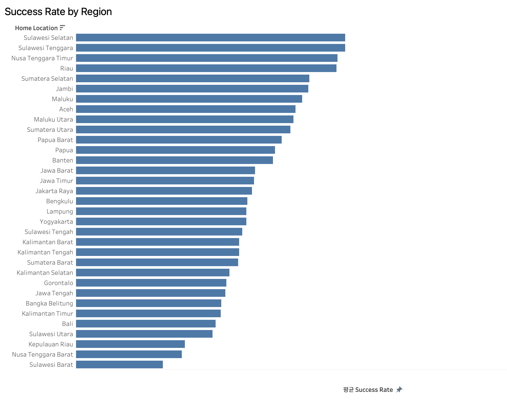
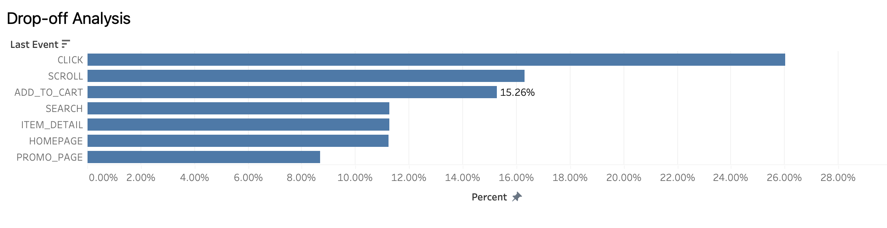
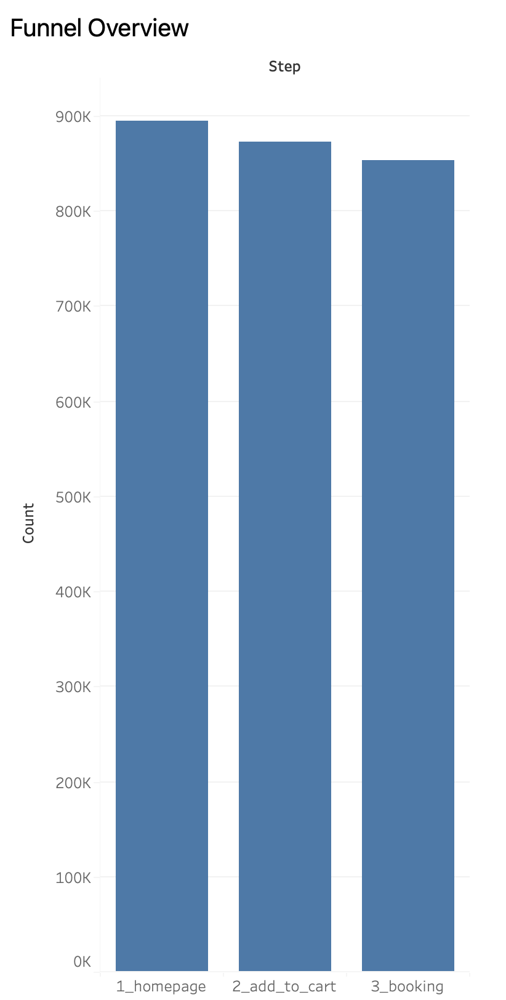

# eCommerce Transaction & Behavior Analysis

## Overview
Analyzed transaction, clickstream, and customer data from an Indonesian eCommerce platform to evaluate payment performance and identify user drop-off patterns across the purchase funnel.

## Data Sources
- `transactions` — payment and order-level transaction records
- `click_stream` — user session behavior logs
- `customer` — user demographic and location data

## Tools
SQL (SQLite), Tableau

## Key Analysis
- Funnel analysis using event sequence tracking
- Drop-off identification based on last interaction events
- Segmentation of non-converting sessions for behavioral analysis

## Key Questions
1. Is the payment success rate stable across regions and devices?
2. Where do users drop off before completing a purchase?

## Key Findings
- Payment success rate remained stable at 95.7% across regions and devices
- Minimal gap between new and returning users (0.04%p), indicating systemic rather than behavioral issues
- 95% overlap between sessions and transactions suggests dataset bias toward completed purchases
- Of 42,621 non-converting sessions, 15.3% dropped off at ADD_TO_CART, making cart abandonment the highest-impact intervention point

## Recommendation
Implement targeted re-engagement strategies (e.g., push notifications or promo incentives within a few hours of cart activity) to recover high-intent users abandoning at the cart stage.

## Business Interpretation
Shifted focus from payment system performance to user behavior optimization, prioritizing cart abandonment recovery as the key lever for conversion improvement.

## Project Structure
**queries**
- 01_booking_level.sql
- 02_daily_success_rate.sql
- 03_success_rate_by_region.sql
- 04_funnel_analysis.sql
- 05_dropoff_last_event.sql

## Dashboard Preview

