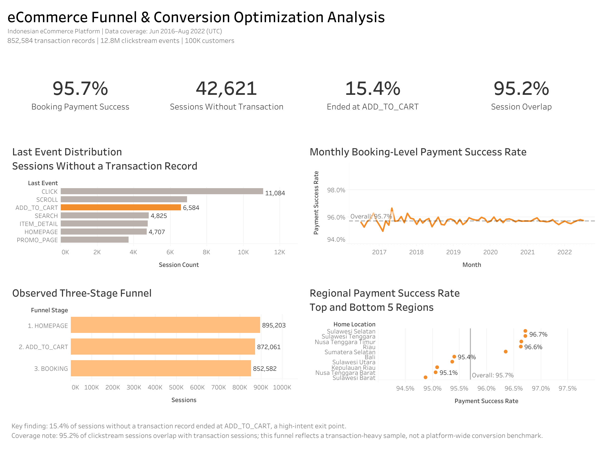

# eCommerce Funnel & Conversion Optimization Analysis

## Overview
Analyzed 852,584 transaction records and 12.8 million clickstream events from an Indonesian eCommerce platform to evaluate payment reliability, trace purchase-funnel behavior, and identify an actionable conversion-recovery opportunity.

**Business Question:** Where does observable conversion leakage occur, and which behavior represents the most actionable recovery opportunity in the available data?

---

## 📊 Data Sources
- `transactions` — 852,584 rows (2016-06-30–2022-07-31 UTC)
- `click_stream` — 12,833,602 rows (2016-06-30–2022-08-01 UTC)
- `customer` — 100,000 rows
- `product` — 42,388 rows

**Tools:** SQL (SQLite), Tableau

---

## 🎯 Key Questions
1. Is the booking-level payment success rate stable over time and across regions?
2. How do sessions progress through the major purchase milestones?
3. Where do sessions with no transaction record end their journeys?
4. How does the dataset's session coverage affect interpretation of the funnel?

---

## 🔍 Analysis Approach

### 1. Booking-Level Data Preparation
- Re-aggregated transaction-line records to one row per `booking_id` and customer
- Marked a booking as failed when any underlying transaction row was marked `Failed`
- **Goal:** Prevent multi-item bookings from being counted more than once

### 2. Payment KPI Validation
- Calculated daily booking-level payment success rates
- Compared success rates across customer home regions
- **Goal:** Assess whether payment failures were concentrated over time or by region

### 3. Milestone Funnel Analysis
- Built a three-stage ordered funnel: `HOMEPAGE` → `ADD_TO_CART` → `BOOKING`
- Measured session progression using the first timestamp recorded for each event
- **Goal:** Evaluate observed movement through major purchase milestones

### 4. Coverage and Last-Event Analysis
- Measured the overlap between clickstream sessions and sessions appearing in transactions
- Validated transaction-to-clickstream linkage: 852,582 of 852,584 transaction sessions had corresponding clickstream records
- Identified 2 transaction sessions with no corresponding clickstream activity and documented them as source-data linkage exceptions
- Isolated 42,621 clickstream sessions with no transaction record
- Classified each session by its final recorded event
- **Goal:** Interpret the unusually high funnel rates and identify a practical recovery target

---

## 💡 Key Findings

### ✅ No Concentrated Payment-Failure Pattern Detected
- Overall booking-level payment success rate: 95.7%
- Daily rates remained broadly stable, and regional differences were limited
- **Insight:** The available data did not reveal a major time- or region-specific payment issue, shifting attention toward pre-transaction behavior

### ⚠️ Headline Funnel Rates Are Affected by Data Coverage
- Approximately **95.2% of clickstream sessions also appear in the transactions data**
- Conversely, transaction-to-clickstream linkage was nearly complete: 852,582 of 852,584 transaction sessions had corresponding clickstream records. The 2 unmatched sessions explain the difference between the transaction count and the 852,582 observed `BOOKING` sessions in the clickstream funnel
- The three-stage funnel therefore produced unusually high progression rates of approximately 97–98%
- **Insight:** The headline funnel is useful for describing the recorded sample but should not be treated as a representative platform-wide conversion rate

### 🚨 Cart-Ending Sessions Are a High-Priority Recovery Opportunity
- Identified **clickstream sessions with no transaction record**
- **15.4% ended at `ADD_TO_CART`**
- These sessions reached a late purchase milestone but did not generate a transaction record
- **Insight:** Cart-ending sessions represent an actionable, high-intent group for targeted recovery efforts

---

## 📈 Business Recommendation

**Prioritize cart abandonment recovery** as a key conversion-optimization lever:

- **Tactic 1:** Send time-sensitive reminders within 2–4 hours of cart activity
- **Tactic 2:** Test personalized incentives, prioritizing higher-value carts when cart-value data is available
- **Tactic 3:** A/B test urgency-based versus incentive-based messaging

**Illustrative Impact:** A hypothetical 10% recovery among the observed `ADD_TO_CART`-ending sessions would correspond to approximately **658 additional sessions reaching a transaction record**, before accounting for order value, campaign cost, or incremental conversion effects.

---

## 🧠 Analytical Skills Demonstrated

| Capability | Evidence in This Project |
| --- | --- |
| Data-grain validation | Re-aggregated transaction-line records to booking level before calculating KPIs |
| KPI monitoring | Tracked daily payment success rates and purchasing-customer volume |
| Segment analysis | Compared booking-level outcomes across regions |
| Event-sequence analysis | Built an ordered session funnel using timestamped clickstream events |
| Data-quality assessment | Quantified session overlap and limited conclusions to the observed sample |
| Action prioritization | Isolated cart-ending sessions and translated the finding into testable interventions |

---

## 📂 Project Structure

**queries**
- 01_booking_level.sql
- 02_daily_success_rate.sql
- 03_daily_purchasing_customers.sql
- 04_success_rate_by_region.sql
- 05_funnel_analysis.sql
- 06_session_overlap_check.sql
- 07_dropoff_last_event.sql

The analysis uses SQLite CTEs, conditional aggregation, joins, and window functions.
Session-linkage validation was also performed using anti-joins to reconcile transaction and clickstream coverage.

---

## 📊 Dashboard Preview

### Tableau

*Executive dashboard summarizing booking-level payment reliability, non-transaction session behavior, observed funnel progression, and regional performance.*

> **Coverage note:** 95.2% of clickstream sessions overlap with sessions in the transactions data. The funnel therefore describes a transaction-heavy sample and should not be interpreted as a platform-wide conversion benchmark.

### Power BI

*Extended the analysis in Power BI with a conversion overview and a separate payment diagnostics view.*

[📄 View full Power BI dashboard (2 pages)](ecommerce_funnel_powerbi.pdf)

---

## 🛠️ Technical Implementation

**SQL Techniques Used:**
- Booking-level aggregation to control duplicate counting
- CTEs for reusable analytical stages
- Conditional aggregation for KPI calculation
- Ordered event timestamps for milestone-funnel construction
- `ROW_NUMBER()` to assign one final event per session
- `NOT EXISTS` to isolate sessions with no transaction record
- Anti-join validation to identify transaction sessions with no corresponding clickstream records

---

## 📌 Key Takeaways

1. **Correct analytical grain:** Recalculated payment KPIs at booking level rather than transaction-line level.

2. **Evidence-led redirection:** Shifted the investigation from payment processing to pre-transaction behavior after validating stable payment KPIs.

3. **Responsible interpretation:** Identified sample bias through session-overlap analysis and avoided treating the funnel as a platform-wide benchmark.

4. **Actionable prioritization:** Isolated cart-ending sessions as a high-intent group for targeted recovery testing.

