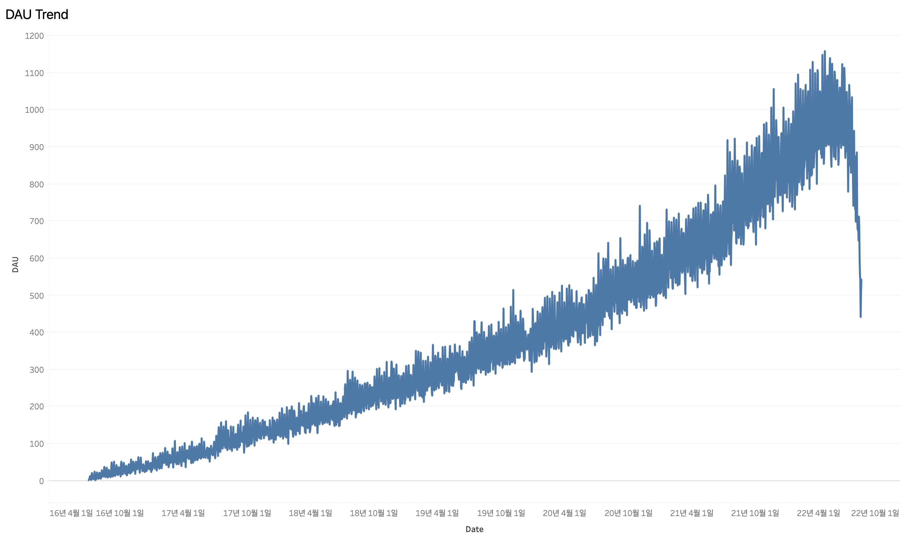
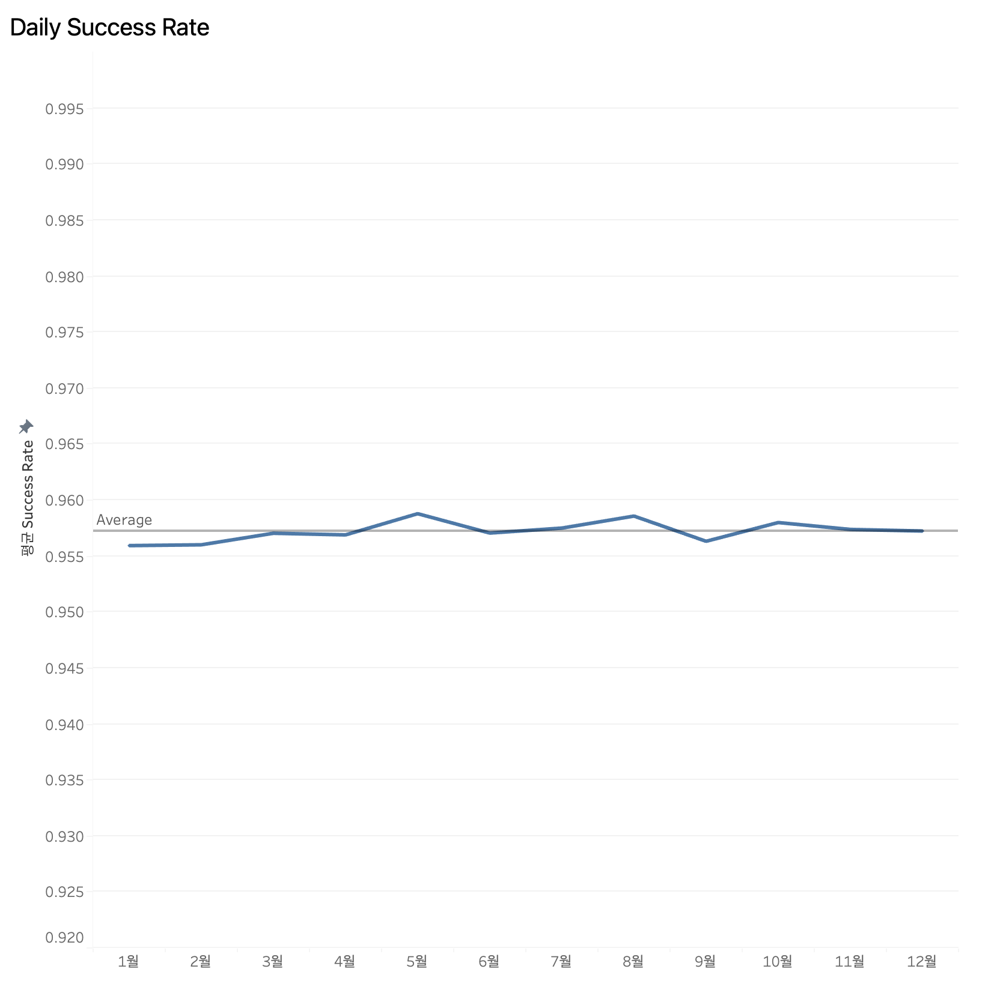
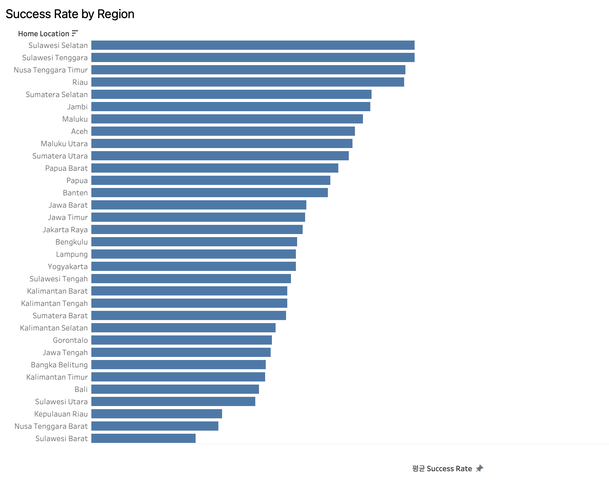
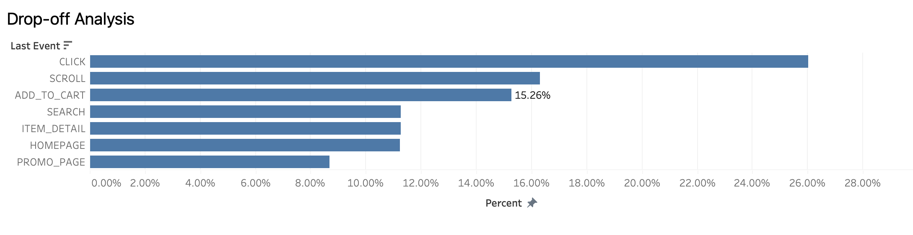
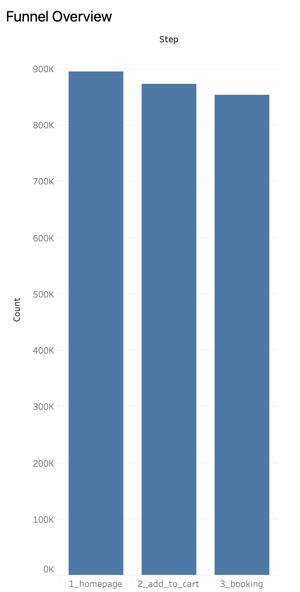

# eCommerce Revenue Leakage & Conversion Optimization Analysis

## Overview
Analyzed 850K+ transactions and 12.8M clickstream events from an Indonesian eCommerce 
platform to diagnose revenue loss across the purchase funnel and identify high-impact 
intervention opportunities.

**Business Question:** Where are we losing revenue, and what's the highest-leverage 
point to recover it?

---

## 📊 Data Sources
- `transactions` — 852,584 rows (2016.07 ~ 2022.07)
- `click_stream` — 12,833,602 rows (2016.07 ~ 2022.08)
- `customer` — 100,000 rows
- `product` — 42,388 rows

**Tools:** SQL (SQLite), Tableau

---

## 🎯 Key Questions
1. Is the payment success rate stable across regions and devices?
2. Where do users drop off before completing a purchase?
3. Which drop-off stage represents the highest-priority conversion recovery opportunity?

---

## 🔍 Analysis Approach

### 1. Payment System Validation
- Evaluated payment success rate across regions, devices, and user segments
- **Goal:** Rule out technical/system issues before investigating behavioral factors

### 2. Funnel Analysis
- Built 5-stage event sequence tracking to quantify drop-off at each decision point
- **Goal:** Identify where potential revenue is being lost

### 3. Non-Converting Session Segmentation
- Isolated 42,621 sessions without completed purchases
- Categorized by last interaction event to pinpoint abandonment patterns
- **Goal:** Determine which stage has the highest recovery potential

---

## 💡 Key Findings

### ✅ No Major Payment-System Issue Detected
- Payment success rate: **95.7%** (stable across regions and devices)
- Minimal gap between new vs returning users (0.04%p)
- **Insight:** The primary revenue leakage appears to be behavioral rather than payment-system- or segment-specific.

### 🚨 Cart Abandonment is a High-Priority Recovery Opportunity
- Of 42,621 non-converting sessions, **15.3% dropped off at ADD_TO_CART**
- These sessions reached the cart stage but did not proceed to a completed transaction
- **Insight:** This is the highest-impact intervention point

### ⚠️ Dataset Limitation Identified
- 95% overlap between sessions and transactions suggests bias toward completed purchases
- Real-world abandonment rates are likely higher
- **Action Taken:** Acknowledged limitation and focused analysis on available data

---

## 📈 Business Recommendation

**Prioritize cart abandonment recovery** as the primary revenue optimization lever:

- **Tactic 1:** Time-sensitive push notifications (within 2-4 hours of cart activity)
- **Tactic 2:** Personalized promo incentives for high-value abandoned carts
- **Tactic 3:** A/B test messaging strategies (urgency vs discount-driven)

**Illustrative Impact:** Assuming a 10% recovery rate among the observed
ADD_TO_CART drop-offs, approximately 650 additional sessions could convert.
This estimate illustrates the potential scale of intervention before accounting
for order value or campaign costs.

---

## 🔄 Operational & Planning Relevance

This project demonstrates analytical capabilities transferable to data-driven
operational and planning roles:

| Project Capability | Transferable Application |
| --- | --- |
| Performance analysis across regions and customer segments | Identifying meaningful variations and exceptions requiring investigation |
| KPI monitoring through Tableau dashboards | Tracking operational indicators and communicating performance trends |
| Funnel and non-converting session analysis | Detecting process bottlenecks and prioritizing high-impact issues |
| Payment-system hypothesis validation | Distinguishing systemic problems from behavioral or segment-specific factors |
| Data limitation assessment | Evaluating data reliability before making operational recommendations |

**Core Principle:** Effective operational decision-making requires identifying
meaningful variations, validating their underlying causes, prioritizing high-impact
issues, and translating findings into measurable corrective actions.

---

## 📂 Project Structure

**queries**
- 01_transaction_level.sql
- 02_daily_success_rate.sql
- 03_success_rate_by_region.sql
- 04_funnel_analysis.sql
- 05_dropoff_last_event.sql

*All SQL queries use SQLite syntax with CTEs and window functions for multi-stage analysis.*

---

## 📊 Dashboard Preview

### 1. Daily Active Users (DAU) Trend

*Tracked platform engagement over time to establish baseline activity levels*

### 2. Payment Success Rate Monitoring

*Validated 95.7% success rate stability, ruling out system issues*

### 3. Regional Performance Breakdown

*Confirmed consistent performance across geographies and devices*

### 4. Drop-Off Stage Analysis

*Identified cart abandonment (15.3%) as primary intervention opportunity*

### 5. Full Funnel Overview

*End-to-end conversion flow showing volume loss at each stage*

---

## 🛠️ Technical Implementation

**SQL Techniques Used:**
- Window functions for event sequencing
- CTEs for multi-stage funnel construction
- CASE statements for session classification
- LEFT JOINs to isolate non-converting behavior

**Tableau Features:**
- Calculated fields for conversion rate metrics
- Parameter-driven filtering (date range, region)
- Dual-axis charts for trend + benchmark comparison

---

## 📌 Key Takeaways

1. **Data-driven prioritization:** Shifted focus from payment system to user behavior 
   after quantifying technical vs behavioral failure rates

2. **High-leverage thinking:** Identified cart abandonment as a priority intervention
   point based on strong purchase intent and a clearly measurable drop-off signal.

3. **Operational relevance:** Demonstrated a structured approach to KPI monitoring,
   exception identification, root-cause investigation, and corrective action
   prioritization.
